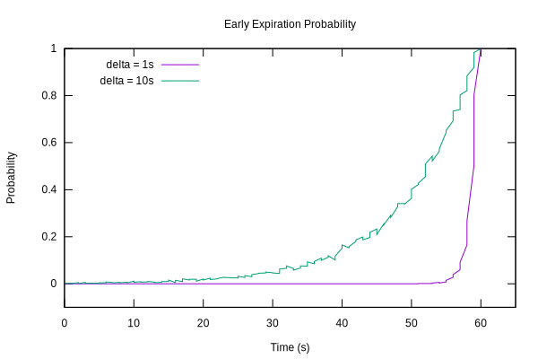

# xfetch-rs

[](https://docs.rs/xfetch/) [](https://crates.io/crates/xfetch)

## About

Rust crate for Optimal Probabilistic Cache Stampede Prevention aka
XFetch algorithm

It can be used in conjunction with cache containers like LRU cache to
implement cache expiration and re-computation in parallel environment
like multi-thread / multi-process computing.

It is very efficient because the algorithm does not need coordination
(no locks) between processes.

## Examples

Create a single cache entry and test it's expiration:

```rust
# struct SomeValue { value: u64, ttl: u64 };
# fn expensive_computation() -> SomeValue { SomeValue { value: 42, ttl: 10000 } }
use xfetch::CacheEntry;
use std::time::Duration;

let entry = CacheEntry::builder(|| {
    expensive_computation()
})
.with_ttl(|value| {
    Duration::from_millis(value.ttl)
})
.build();

assert!(!entry.is_expired());
```

The [CacheEntry](struct.CacheEntry.html) can be used with any cache library.
For example the `lru` crate:

```rust
use lru::LruCache;
use xfetch::CacheEntry;
use std::time::Duration;

struct SomeValue {
    value: u64,
    ttl: u64
};

fn recompute_value(n: u64) -> SomeValue {
    SomeValue { value: n, ttl: 10000 }
}

fn main() {
    let mut cache = LruCache::new(2);

    cache.put("apple", CacheEntry::builder(|| recompute_value(3))
        .with_ttl(|v| Duration::from_millis(v.ttl))
        .build());
    cache.put("banana", CacheEntry::builder(|| recompute_value(2))
        .with_ttl(|v| Duration::from_millis(v.ttl))
        .build());

    if let Some(entry) = cache.get(&"apple") {
        if !entry.is_expired() {
            assert_eq!(entry.get().value, 3);
        } else {
            cache.put("apple", CacheEntry::builder(|| recompute_value(3))
                .with_ttl(|v| Duration::from_millis(v.ttl))
                .build());
        }
    }
}
```

Plot showing the simulated probability of early expiration of different system:



## References

- Wikipedia [Cache Stampede][wikipedia].
- Vattani, A.; Chierichetti, F.; Lowenstein, K. (2015), [Optimal
  Probabilistic Cache Stampede Prevention][vldb] (PDF), 8 (8), VLDB, pp. 886–897,
  ISSN 2150-8097.
- Jim Nelson, Internet Archive, [RedisConf17 - Preventing cache stampede with Redis & XFetch][archive].

[vldb]: http://www.vldb.org/pvldb/vol8/p886-vattani.pdf
[wikipedia]: https://en.wikipedia.org/wiki/Cache_stampede
[archive]: https://www.slideshare.net/RedisLabs/redisconf17-internet-archive-preventing-cache-stampede-with-redis-and-xfetch

## License

Licensed under either of

- Apache License, Version 2.0, ([LICENSE-APACHE](LICENSE-APACHE) or <http://www.apache.org/licenses/LICENSE-2.0>)
- MIT license ([LICENSE-MIT](LICENSE-MIT) or <http://opensource.org/licenses/MIT>)

at your option.

### Contribution

Unless you explicitly state otherwise, any contribution intentionally submitted
for inclusion in the work by you, as defined in the Apache-2.0 license, shall be
dual licensed as above, without any additional terms or conditions.
